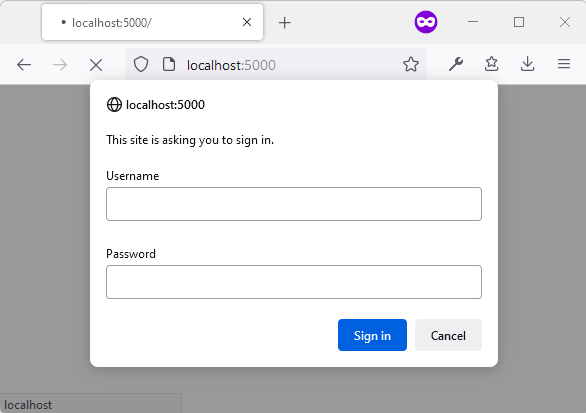
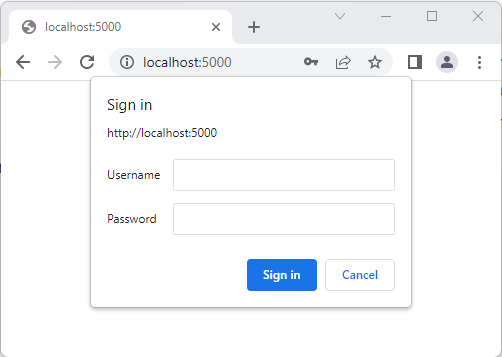

[SON State of the Nation data explorer](../README.md) >
[Developer documentation](README.md) >
HTTP Basic Authentication

# HTTP Basic Authentication

Our non-production environments are protected with HTTP Basic Authentication. HTTP Basic Authentication can also be added to the production website using the same method described below.

## Why do we use HTTP Basic Authentication?

It's important that members of the public can't access our non-productions environments, because:
* they could easily mistake a non-production environment for the live services.
* they could access the live service before it "goes live", whilst we're still making breaking changes to the service.

## How does HTTP Basic Authentication help?

If HTTP Basic Authentication is enabled, when a user tries to access the service, their browser will show a popup.  
The popup looks like this in Firefox:  
  
The popup looks like this in Google Chrome:  
  

## What is the password?

Ask a member of the team for the password.

## How to enable / disable HTTP Basic Authentication on an environment

* Log into the [GitHub secrets page](https://github.com/cabinetoffice/smc-son/settings/secrets/actions)
* To disable HTTP Basic Authentication, edit the `BASIC_AUTH_USERNAME` and `BASIC_AUTH_PASSWORD` secrets to `OFF` for the desired environment
* To enable HTTP Basic Authentication, edit the `BASIC_AUTH_USERNAME` and `BASIC_AUTH_PASSWORD` secrets to a username and password of your choice for the desired environment
* Redeploy the site - navigate to [GitHub Actions](https://github.com/cabinetoffice/smc-son/actions), click on the desired deployment to run `Terraform, Build, Deploy (env)`, then run a deployment job
