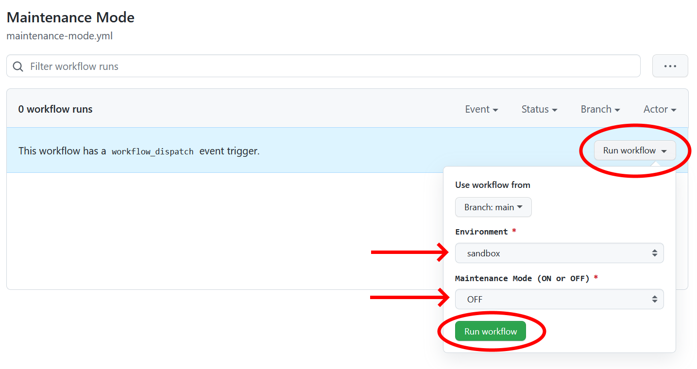

[SON State of the Nation data explorer](../README.md) >
[Developer documentation](README.md) >
How to put the service into Maintenance Mode

# How to put the service into Maintenance Mode / make the service unavailable

## What is this for?

It may occasionally be necessary to put the application into Maintenance Mode / make the service unavailable.

For example, if we detect a problem, and want to make sure no-one uses the service whilst the service is broken.

## What does Maintenance Mode look like

We use the [Gov.UK Design System "Service unavailable" pattern](https://design-system.service.gov.uk/patterns/service-unavailable-pages/).

All pages on the website will be replaced with a page saying "Sorry, the service is unavailable"

## How to activate / deactivate Maintenance Mode (via GitHub Actions)

The simplest way to activate / deactivate Maintenance Mode is via GitHub Actions.

* Go to [The "Maintenance Mode" GitHub Action](https://github.com/cabinetoffice/smc-son/actions/workflows/maintenance-mode.yml)
* Click "Run workflow"
* Select the **Environment** (dev or production)
* Select the **Maintenance Mode** setting (ON or OFF)
* Click "Run workflow"  
  
* The GitHub Action should then run and turn Maintenance Mode on or off for the environment you selected.  
  Check the result of the workflow to check this was successful
* Check the application itself to ensure Maintenance Mode is working (enabled or disabled) as you expect

## How to activate / deactivate Maintenance Mode (via GitHub)

* Log into the [GitHub secrets page](https://github.com/cabinetoffice/smc-son/settings/secrets/actions)
* Update the `MAINTENANCE_MODE` secret for the desired environment
* Redeploy the site - navigate to [GitHub Actions](https://github.com/cabinetoffice/smc-son/actions), click on the desired deployment to run `Terraform, Build, Deploy (env)`, then run a deployment job

## How to activate / deactivate Maintenance Mode (via the command line)

Maintenance ode can also be activated from the command line by updating environment variables in the EC2 instance:

* Log into AWS, navigate to EC2.
* Select the EC2 instance for the desired environment (i.e. prod, dev), click Conntect
* Update the `MAINTENANCE_MODE` environment variable
* Restart the Gunicorn service

Note that when the site is redeployed, these environment variables will be overwritten with the values stored in GitHub secrets.
